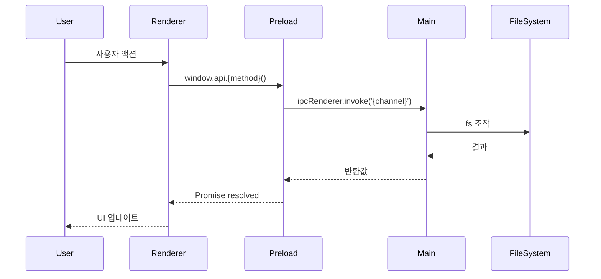
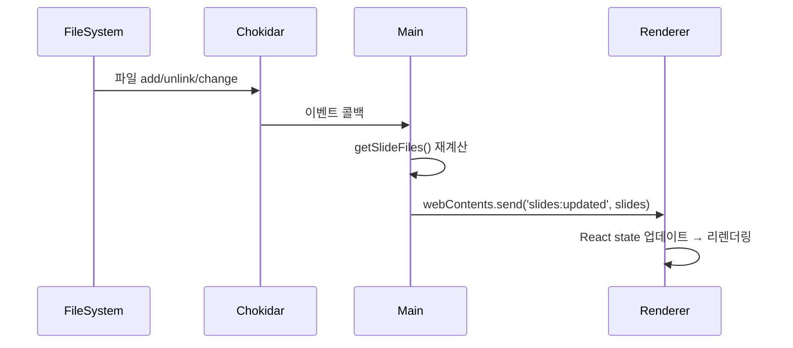

# Step 2: 설계

인수 테스트를 통과시키기 위한 아키텍처와 코드 구조를 설계하는 단계입니다.

## 진행 순서

1. C4 모델 기반 점진적 분석
2. 시퀀스 다이어그램 작성
3. 설계 결정 기록 (ADR, 필요시)
4. 구현 단위별 상세 계획 작성

## 산출물

```
/docs/features/{feature-name}/2-design/
├── c4-analysis.md
├── sequence-diagram.md
├── implementation-units.md
└── decisions/
    └── ADR-*.md (필요시)
```

---

## ⚠️ 중요: 문서 우선 접근 방식 (Document-First)

**설계 시 반드시 지켜야 할 규칙:**

```
❌ 코드 검색부터 하지 말 것
✅ 문서 검토부터 시작할 것
```

**필수 읽기**: `@docs/c4/current/` — 현재 구현 상태

---

## C4 모델 기반 점진적 분석

다음 패턴으로 세부 단계들을 진행합니다:

1. **Container 분석**
   - **필수**: `@docs/c4/current/02_container.md` 먼저 읽기
   - Electron 프로세스 경계 파악 (Main / Preload / Renderer)

2. **Component 분석 — Main Process**
   - **필수**: `@docs/c4/current/03_component_main.md` 먼저 읽기
   - 기존 IPC 핸들러, 파일 매니저, 스토어 파악

3. **Component 분석 — Renderer**
   - **필수**: `@docs/c4/current/04_component_renderer.md` 먼저 읽기
   - 기존 화면(Home/Editor/Present), 컴포넌트 파악

4. **Component 분석 — Preload**
   - **필수**: `@docs/c4/current/05_component_preload.md` 먼저 읽기
   - 기존 `window.api` 메서드 파악

5. **기존/수정/신규 코드 식별**
   - 문서 기반으로 식별 후 필요시에만 코드 확인

6. **시퀀스 다이어그램 작성** — UI 명세의 사용자 여정 반영

**Blueprint와 Current 비교 활용:**
- `@docs/c4/blueprint/` — 목표 아키텍처
- `@docs/c4/current/` — 현재 구현 상태

---

## c4-analysis.md 템플릿

```markdown
# C4 모델 분석: {feature-name}

## 0. UI 요구사항 검토 (UI가 있는 경우)

**참고 문서**: `/docs/features/{feature-name}/1-requirements/ui-specification.md`

### UI 컴포넌트 → 코드 매핑
- {화면/컴포넌트명} → {예상 파일 경로}
- {사용자 여정 단계} → {필요한 IPC 채널 / Main 핸들러}
- {상태 변화} → {React state 요구사항}

---

## 1. Container 레벨 분석

**참고**: `@docs/c4/current/02_container.md`

- **영향받는 프로세스**: [Main / Preload / Renderer]
- **새로운 IPC 채널**: [신규 채널 목록]
- **기존 채널 변경**: [변경되는 채널 목록]

---

## 2. Component 분석 — Main Process

**참고**: `@docs/c4/current/03_component_main.md`

### 기존 코드 (재사용)
- `src/main/{파일}`: {함수/모듈명} — 용도

### 수정 필요 코드
- `src/main/{파일}`:
  - 현재: 현재 동작
  - 변경: 필요한 변경사항
  - 이유: 변경 근거

### 신규 코드
- `src/main/{파일}`:
  - 목적:
  - 주요 함수:
  - 의존성:

---

## 3. Component 분석 — Renderer

**참고**: `@docs/c4/current/04_component_renderer.md`

### 기존 코드 (재사용)
### 수정 필요 코드
### 신규 코드

---

## 4. Component 분석 — Preload

**참고**: `@docs/c4/current/05_component_preload.md`

### 추가할 window.api 메서드
- `{methodName}`: {설명}

---

## 5. 아키텍처/디자인 수정 사항

- `docs/c4/current/` 문서 업데이트 필요 항목:
  - {파일명}: {변경 내용}
```

---

## sequence-diagram.md 템플릿

```markdown
# 시퀀스 다이어그램: {feature-name}

**UI 명세 참조**: `/docs/features/{feature-name}/1-requirements/ui-specification.md`

## 주요 플로우 (UI 사용자 여정 기반)

### 시나리오 1: {정상 케이스}



### 시나리오 2: 파일 변경 감지 (chokidar → push)



## 설계 결정사항

- 결정 1: {결정 내용과 근거}
```

---

## implementation-units.md 템플릿

```markdown
# 구현 단위별 상세 계획: {feature-name}

## 구현 우선순위

### Phase 1: Main Process
1. [수정/신규] {ipcMain 핸들러 또는 유틸 함수}

### Phase 2: Preload
2. [수정/신규] {window.api 메서드}

### Phase 3: Renderer
3. [수정/신규] {React 컴포넌트 또는 화면}

---

## Phase 1: Main Process

### 1.1 [신규] {구체적 유닛명}

**파일**: `src/main/index.ts` 또는 `src/main/{module}.ts`

**변경사항**:
- {구체적 변경 내용}

**추가할 코드**:
```typescript
ipcMain.handle('{channel}', async (_, param: Type) => {
  // ...
  return result
})
```

**유닛 테스트 요구사항**:
- [ ] {테스트 케이스 1}
- [ ] {테스트 케이스 2}

---

## 구현 체크리스트

### Phase 1: Main Process
- [ ] 1.1 {유닛명} + 테스트

### Phase 2: Preload
- [ ] 2.1 {유닛명}

### Phase 3: Renderer
- [ ] 3.1 {유닛명} + 테스트

각 Phase별로 TDD 방식을 따라 **테스트 먼저 작성 → 구현 → 테스트 통과** 순으로 진행합니다.
```

---

## ADR 템플릿 (필요시)

중요한 설계 결정은 ADR(Architecture Decision Record)로 기록합니다.

```markdown
# ADR-{번호}: {결정 제목}

## 상태
제안됨 | 승인됨 | 거부됨 | 폐기됨 | 대체됨

## 컨텍스트
{결정이 필요한 상황과 배경}

## 결정
{내린 결정}

## 결과

### 긍정적 결과
- {긍정적 영향}

### 부정적 결과
- {부정적 영향}

### 중립적 결과
- {중립적 영향}
```

---

## 설계 검토 체크리스트

### 📚 문서 기반 설계 체크 (필수)
- [ ] `docs/c4/current/02_container.md`를 읽었는가?
- [ ] `docs/c4/current/03_component_main.md`를 읽었는가?
- [ ] `docs/c4/current/04_component_renderer.md`를 읽었는가?
- [ ] `docs/c4/current/05_component_preload.md`를 읽었는가?
- [ ] 문서에서 기존 IPC 채널을 확인했는가?
- [ ] 문서에서 재사용 가능 코드를 확인했는가?
- [ ] 코드 검색이 정말 필요했는가? (이유 명시했는가?)

### 설계 품질 체크
- [ ] 인수 테스트를 통과시킬 수 있는 설계인가?
- [ ] 기존 아키텍처와 일관성을 유지하는가?
- [ ] 단일 책임 원칙을 준수하는가? (Node.js API → Main, UI → Renderer)
- [ ] IPC 채널 이름이 기존 컨벤션과 일치하는가? (`{domain}:{action}`)
- [ ] 의존성 방향이 올바른가? (Renderer → Preload → Main, 역방향 금지)
- [ ] 파일 감시 이벤트가 올바르게 설계되었는가?
- [ ] implementation-units.md가 TDD로 바로 변환 가능한가?

---

## 참고 문서

- `@docs/c4/current/`: 현재 구현 상태 (필수)
- `@docs/c4/blueprint/`: 목표 아키텍처 (참조)

---

## 다음 단계

Step 3: 유닛 테스트 작성 및 구현으로 진행합니다.
