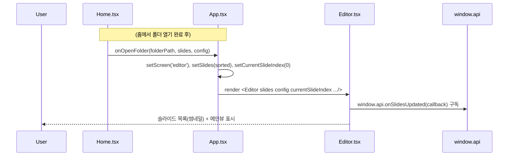
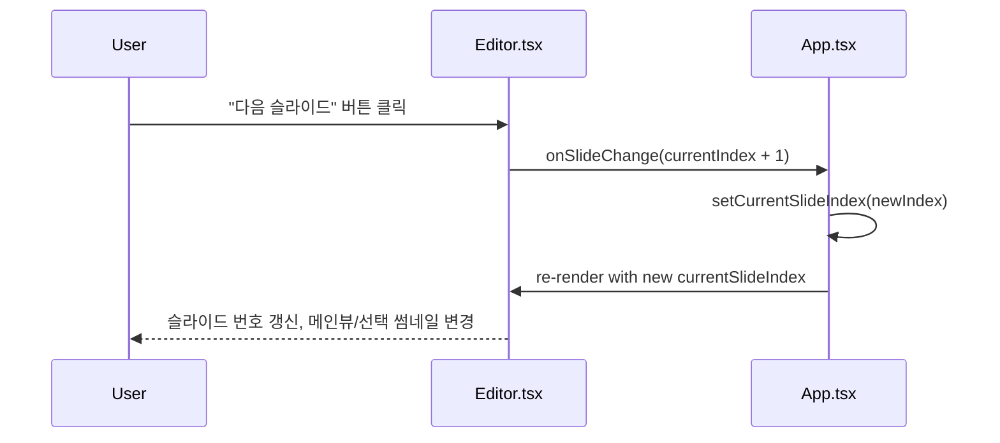
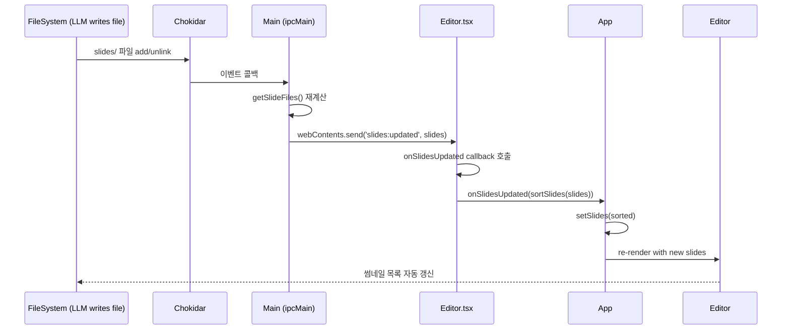
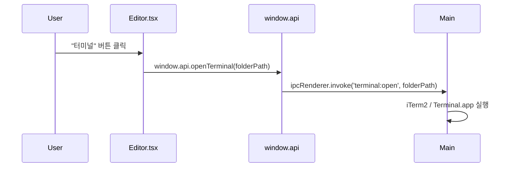

# 시퀀스 다이어그램: editor

**UI 명세 참조**: `/docs/features/editor/1-requirements/ui-specification.md`

## 주요 플로우

### 시나리오 1: 편집 화면 진입 (홈에서 폴더 열기)

### 시나리오 2: 다음/이전 슬라이드 이동

### 시나리오 3: chokidar → slides:updated push (자동 갱신)

### 시나리오 4: 터미널 열기

## 설계 결정사항

- SlideView는 별도 컴포넌트로 분리 (Editor에서 재사용, Present에서도 사용)
- `onSlidesUpdated` 구독은 Editor 마운트 시 등록, 언마운트 시 cleanup
- 슬라이드 없음 상태: 사이드바 빈 상태 + 메인뷰에 안내 텍스트 (SlideView 미렌더링)
- 현재 슬라이드 인덱스는 App.tsx에서 관리 (Present로 전환 시 유지)
