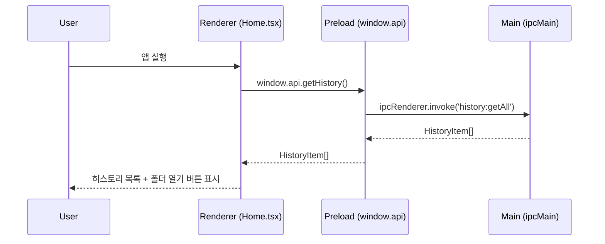
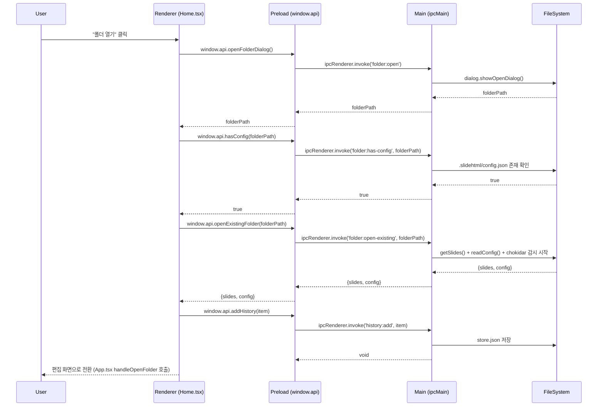
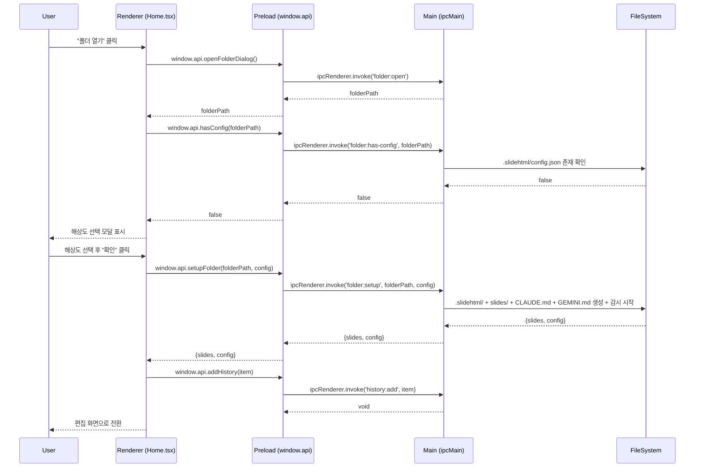
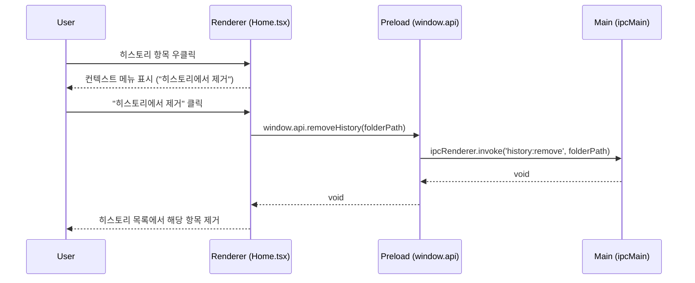

# 시퀀스 다이어그램: home

**UI 명세 참조**: `/docs/features/home/1-requirements/ui-specification.md`

## 주요 플로우

### 시나리오 1: 앱 시작 → 홈 화면 표시

### 시나리오 2: 폴더 열기 → 기존 프로젝트 열기

### 시나리오 3: 폴더 열기 → 신규 프로젝트 (해상도 모달)

### 시나리오 4: 히스토리 항목 우클릭 → 삭제

## 설계 결정사항

- 컨텍스트 메뉴: 네이티브 Menu 대신 커스텀 DOM 컨텍스트 메뉴로 구현 (contextmenu 이벤트 차단 + 절대 위치 div)
- 해상도 모달: 별도 컴포넌트 없이 Home.tsx 인라인 상태로 관리 (MVPs 단순성)
- 히스토리 추가: 편집 화면 전환 직전 Home에서 처리 (App.tsx에서 하지 않음)
